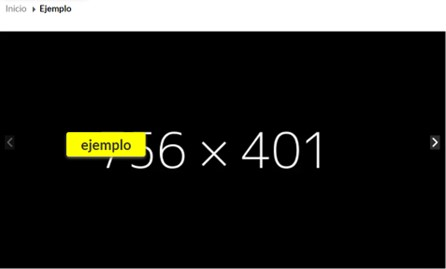
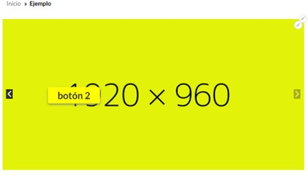

# Diseño de bloques
En este capítulo se explica los diferentes tipos de diseños que hay para cada vista 

### 1. **Banner slider**

Está diseñado para la cabecera de los basic page, puedes agregar la cantidad de imágenes que gustes (te pedirá también imágenes para todos los dispositivos), puedes poner un botón en cada slide si quieres que redireccione a tu lugar de preferencia:
    
  * Primer slide
  
  * Segundo slide
  
  
### 2. **Bloque descripción**

puedes poner una imagen acompañado del texto
    
  * Primer slide
  
  * Segundo slide
  
  